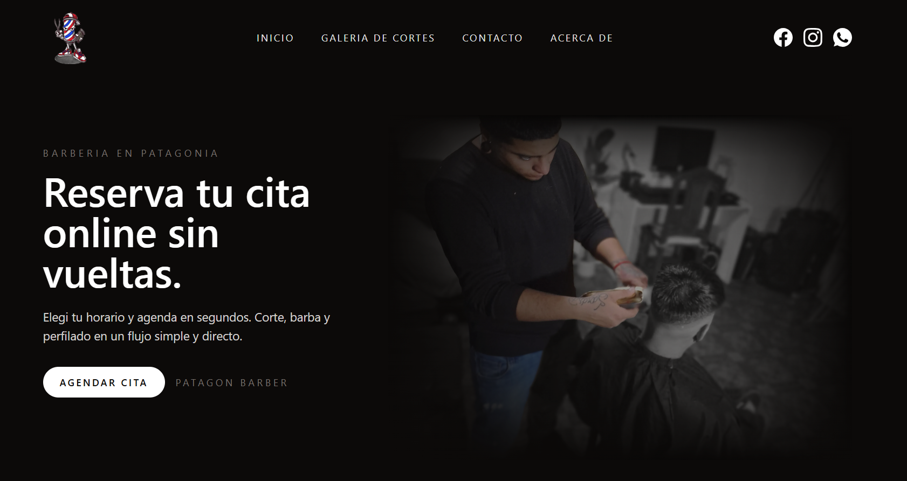
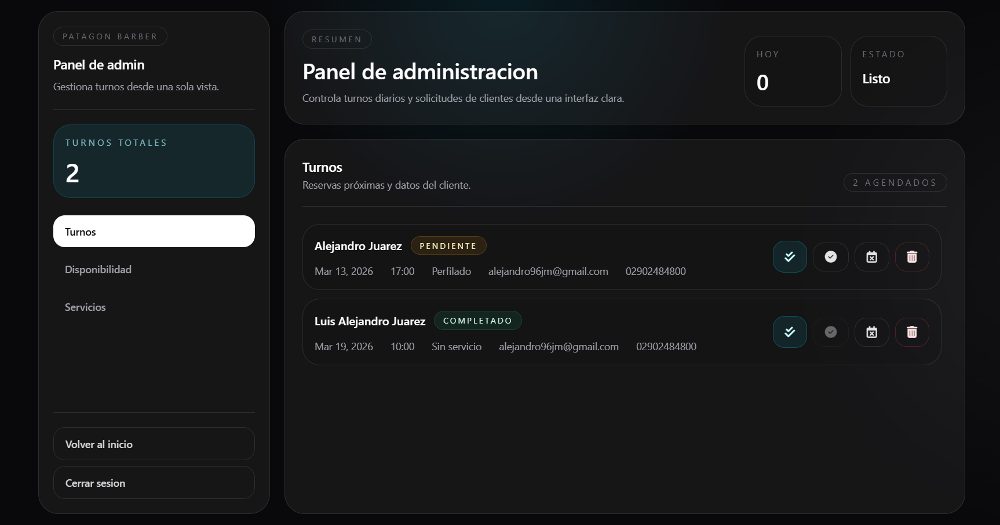

# Patagon Barber

Monorepo for a barber business app with:

- Public website (`frontend`) with home, gallery, and reservation modal.
- Admin panel (`frontend`) for appointments, weekly availability, and services catalog.
- REST API (`backend`) with cookie-based auth and SQLite persistence.

## Screenshots

### Home



### Gallery


### Image Preview


### Admin Panel



### Reservation Form


## Tech Stack

- Frontend: React 18, TypeScript, Vite, Tailwind, MUI (`@mui/material`, `@mui/x-date-pickers`), Wouter.
- Backend: Node.js, Express, TypeScript, JWT, cookie-parser, CORS.
- Database: Turso/SQLite via `@libsql/client`.

## Monorepo Structure

```text
.
├─ frontend/                  # Vite + React app
├─ backend/                   # Express API
│  └─ sql/turso/              # SQL bootstrap scripts
└─ package.json               # Workspace scripts
```

## Main Features

- Public reservation flow:
  - Client data + service selection.
  - Date selection with desktop/mobile behavior.
  - Hour slots filtered by:
    - configured availability,
    - occupied slots,
    - past times for current day.
- Admin panel:
  - Login/session with HTTP-only cookie.
  - Appointments list, status updates, deletion.
  - Availability editor (days/hours).
  - Services editor (`service_name`, `price`, `enabled`).
- Gallery page with image preview.

## Routes

### Frontend routes

- `/` and `/home`: home.
- `/gallery`: gallery.
- `/admin-panel` and `/admin-panel/login`: admin login.
- `/admin-panel/home`: admin dashboard.

### Backend routes

- `POST /api/admin-panel/login`
- `GET /api/admin-panel/session`
- `POST /api/admin-panel/logout`
- `GET /api/appointments/occupied`
- `POST /api/appointments`
- `GET /api/appointments` (auth required)
- `PATCH /api/appointments/:id/status` (auth required)
- `DELETE /api/appointments/:id` (auth required)
- `GET /api/availability`
- `PUT /api/availability` (auth required)
- `GET /api/services`
- `PUT /api/services` (auth required)

## Prerequisites

- Node.js 20+ recommended.
- npm 10+.
- Turso database + Turso auth token.

## Local Setup

### 1. Install dependencies

From repo root:

```bash
npm install
```

### 2. Configure backend env

Create `backend/.env` from `backend/.env.example`:

```env
PORT=3000
FRONTEND_ORIGIN=http://localhost:5173
JWT_SECRET=replace-with-a-long-random-secret
TURSO_DB_URL=libsql://your-database.turso.io
TURSO_AUTH_TOKEN=your-turso-auth-token
AUTH_COOKIE_SAME_SITE=Lax
AUTH_COOKIE_SECURE=false
AUTH_COOKIE_DOMAIN=
ADMIN_AUTH_BYPASS=true
```

For normal auth testing, set:

```env
ADMIN_AUTH_BYPASS=false
```

### 3. Configure frontend env (optional)

If not set, frontend defaults to `http://localhost:3000` for API calls.

Create `frontend/.env` if needed:

```env
VITE_API_URL=http://localhost:3000
VITE_PROXY_TARGET=http://localhost:3000
VITE_BYPASS_ADMIN_AUTH=false
```

### 4. Initialize Turso schema

Use scripts in `backend/sql/turso/`:

```bash
turso db shell <your-db> < backend/sql/turso/001_init_schema.sql
turso db shell <your-db> < backend/sql/turso/002_seed_admin.example.sql
```

Important:

- Edit `002_seed_admin.example.sql` before running (username/password).
- First successful login upgrades plain-text password to bcrypt automatically.

### 5. Run app

From root:

```bash
npm start
```

This starts:

- backend on `http://localhost:3000`
- frontend on Vite default port (`http://localhost:5173`)

## Build

### Frontend

```bash
npm --prefix frontend run build
```

### Backend

```bash
npm --prefix backend run tsc
npm --prefix backend run start
```

## Auth & Cookies

- Cookie name: `patagon_barber_auth`
- HTTP-only, path `/`
- `sameSite`, `secure`, `domain` controlled via env:
  - `AUTH_COOKIE_SAME_SITE`
  - `AUTH_COOKIE_SECURE`
  - `AUTH_COOKIE_DOMAIN`

Production baseline:

- `AUTH_COOKIE_SECURE=true`
- `AUTH_COOKIE_SAME_SITE=Lax` (same-site setups) or `None` (cross-site + HTTPS).
- strong `JWT_SECRET`.

## Author

- Alejandro Juarez
